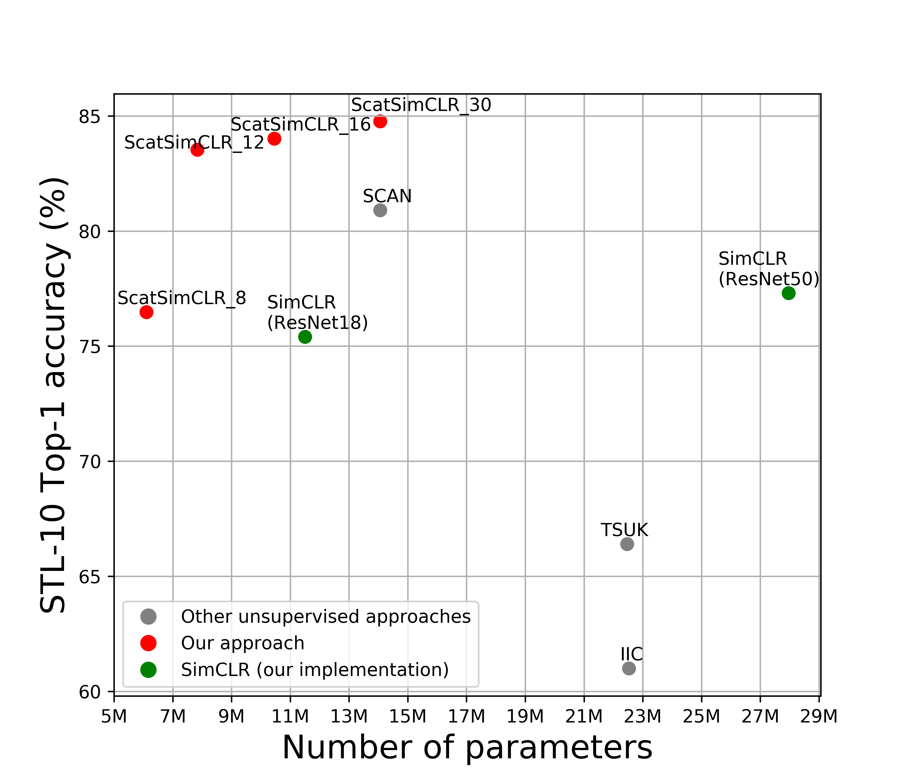
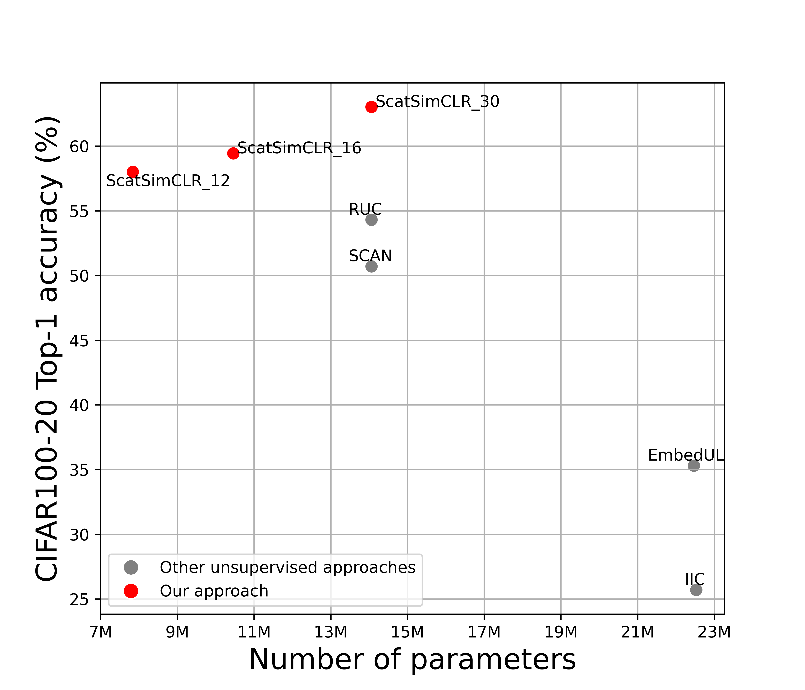
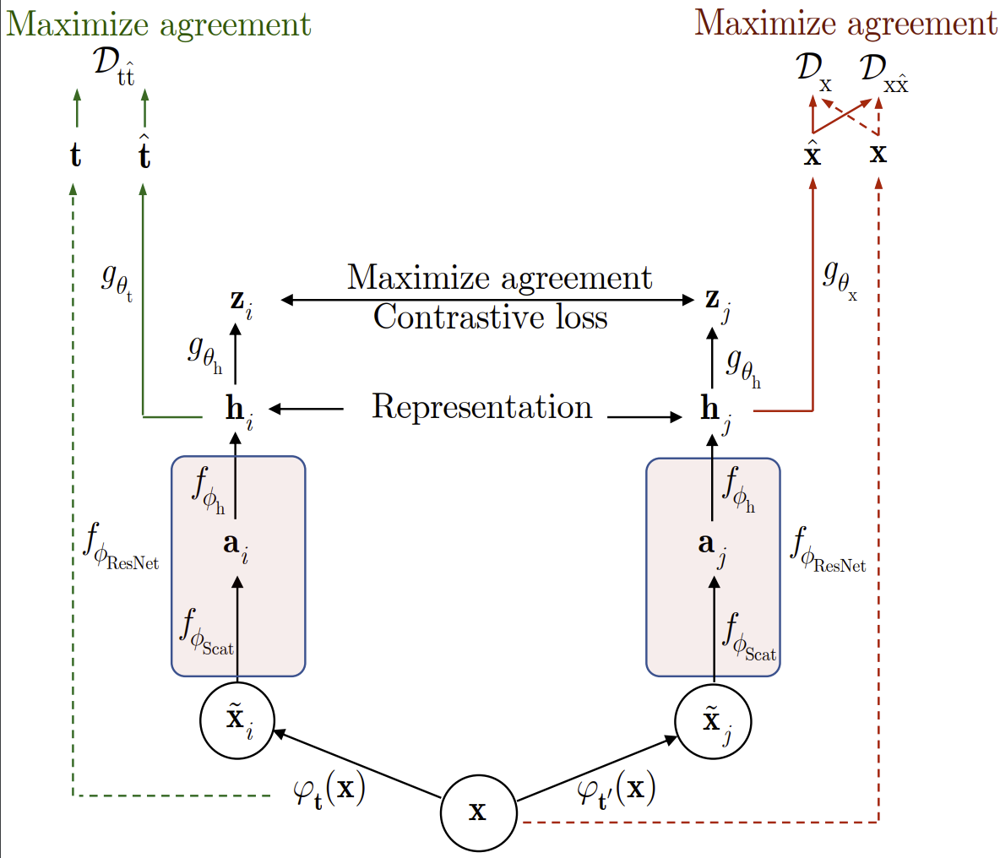

 
[](https://paperswithcode.com/sota/unsupervised-image-classification-on-cifar-20)
[](https://paperswithcode.com/sota/unsupervised-image-classification-on-stl-10)

# ScatSimCLR: self-supervised contrastive learning with pretext task regularization for small-scale datasets

This repo contains official Pytorch implementation of the paper:

**ScatSimCLR: self-supervised contrastive learning with pretext task regularization for small-scale datasets** 
accepted at ICCV 2021 workshop
[2nd Visual Inductive Priors for Data-Efficient Deep Learning Workshop](https://vipriors.github.io/) </br>
[Vitaliy Kinakh](https://vkinakh.github.io/), [Olga Taran](http://sip.unige.ch/team/olga-taran/), [Sviatoslav Voloshynovskiy](http://sip.unige.ch/team/prof-sviatoslav-voloshynovskiy/)

[Paper](https://arxiv.org/abs/2108.13939) <!--[Presentation](INSERT LINK HERE) [Video](INSERT LINK HERE)-->

- 🏆 __SOTA__ on CIFAR20 Unsupervised Image Classification. Check out [Papers With Code](https://paperswithcode.com/paper/scatsimclr-self-supervised-contrastive-1)

<p align="center"> 

</p>

<p align="center"></p>

## Contents
1. [Introduction](#introduction)
0. [Installation](#installation)
0. [Training](#training)
0. [Evaluation](#evaluation)
0. [Results](#results)
0. [Citation](#citation)


### Introduction

In this paper, we consider a problem of **self-supervised** learning for **small-scale datasets** based on 
**contrastive loss**. Such factors as the complexity of training requiring complex architectures, the needed
number of views produced by data augmentation, and their impact on the  classification accuracy are understudied
problems. We consider an architecture of contrastive loss system such as **SimCLR**, where baseline model is 
replaced by geometrically invariant **“hand-crafted” network ScatNet** with small trainable adapter network and
argue that the number of parameters of the whole system and the number of views can be considerably reduced while
practically preserving the same classification accuracy. </br> In addition, we investigate the impact of regularization strategies using pretext task learning based on an
estimation of parameters of augmentation transform such as rotation and jigsaw permutation for both traditional
baseline models and ScatNet based models. </br> Finally, we demonstrate that the proposed architecture with pretext
task learning regularization achieves the state-of-the-art classification performance with a smaller number of
trainable parameters and with reduced number of views.

We outperform state-of-the-art methods, in particular +8.9% on CIFAR20, and INSERT HERE on STL10 in terms of 
classification accuracy.

### Installation

#### Conda installation
```commandline
conda env create -f env.yml
```

### Training

To run training without pretext task, fill the **config file**. Example of detailed config file for training without
pretext task is `config.yaml`.

Then run
```commandline
python main.py --mode unsupervised --config <path to config file>
```

To run training with pretext task, fill **config file**. Example of detailed config file for training with pretext task
is `config_pretext.yaml`.

Then run
```commandline
python main.py --mode pretext --config <path to config file>
```

### Evaluation
To run evaluation fill the **config file** the same way as config for training without pretext task: `config.path`. 
Put path to the model in `fine_tune_from`.

Then run
```commandline
python evaluate.py --config <path to config file>
```

### Results
|Dataset | Top-1 accuracy| Model        |Image size| J | L  | Download link |
|--------|---------------|--------------|----------|---|----|---|
|STL10   | 85.11%        | ScatSimCLR30 |(96, 96)  | 2 | 16 | [Download](https://drive.google.com/drive/folders/1W6LaQsUo3DxJVR6dsmcq4uGioik3BcDf?usp=sharing)|
|CIFAR20 | 63.86%        | ScatSimCLR30 |(32, 32)  | 2 | 16 | [Download](https://drive.google.com/drive/folders/1dhDMzNaB5PhXPqarwBw1KDCbs6DtHwOc?usp=sharing) |
 
### Citation

```commandline
@inproceedings{
    kinakh2021scatsimclr,
    title={ScatSim{CLR}: self-supervised contrastive learning with pretext task regularization for small-scale datasets},
    author={Vitaliy Kinakh and Slava Voloshynovskiy and Olga Taran},
    booktitle={2nd Visual Inductive Priors for Data-Efficient Deep Learning Workshop},
    year={2021},
    url={https://openreview.net/forum?id=IQ87KPOWyg1}
}
```